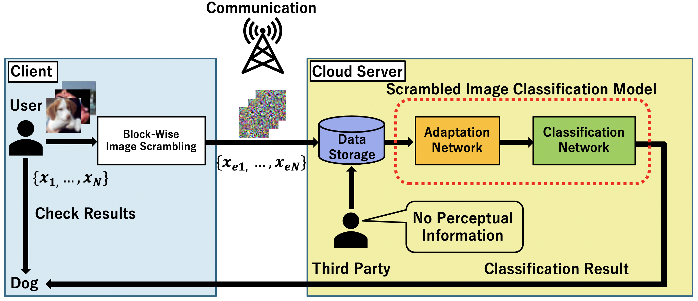
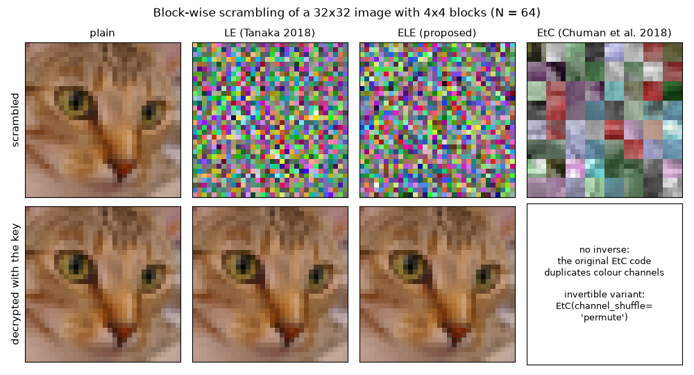
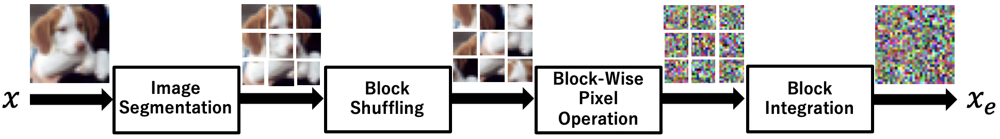

# Block-wise Scrambled Image Recognition Using Adaptation Network

Official PyTorch implementation of the paper *Block-wise Scrambled Image Recognition Using Adaptation Network* (AAAI-20 Workshop on AIoT, 2020).

[Koki Madono](https://madonokouki.github.io/)<sup>1,2</sup>, Masayuki Tanaka<sup>2</sup>, Masaki Onishi<sup>2</sup>, Tetsuji Ogawa<sup>1,2</sup><br>
<sup>1</sup>Department of Communications and Computer Engineering, Waseda University &nbsp; <sup>2</sup>National Institute of Advanced Industrial Science and Technology (AIST)

[](https://madonokouki.github.io/projects/blockscramble/)
[](https://arxiv.org/abs/2001.07761)
[](https://aiotworkshop.github.io/2020/published/Block-wise%20Scrambled%20Image%20Recognition%20Using%20Adaptation%20Network.pdf)
[](LICENSE)
[](https://www.python.org/)
[](https://pytorch.org/)
[](https://github.com/MADONOKOUKI/Block-wise-Scrambled-Image-Recognition/actions/workflows/tests.yml)
[](https://colab.research.google.com/github/MADONOKOUKI/Block-wise-Scrambled-Image-Recognition/blob/master/notebooks/quickstart.ipynb)



**TL;DR** A client can hide what its images show from a cloud-side model developer by scrambling every
block of pixels with a secret key, but ordinary CNNs recognise such images poorly. The paper introduces
**ELE**, a block-wise scrambling with a different key for every block plus block shuffling (a larger key
space than LE and EtC), and **ELE-AdaptNet**, an adaptation network placed in front of a standard classifier.
ELE-AdaptNet has per-block sub-networks, a learnable pseudo permutation matrix that can undo the block
shuffling, and a pixel-shuffle layer. On CIFAR-10/100 it gives the best accuracy of the compared networks
on ELE- and EtC-scrambled images.

## News

- 2026-10: Code refactored into an installable package with a Colab quick start; the original research code is kept in [archive/](archive/).

## Installation

```bash
git clone --depth 1 https://github.com/MADONOKOUKI/Block-wise-Scrambled-Image-Recognition
cd Block-wise-Scrambled-Image-Recognition
pip install -e .                # add ".[examples]" for the quick-start figure (matplotlib, scikit-image)
```

or install only the library (`import blockscramble`):

```bash
pip install git+https://github.com/MADONOKOUKI/Block-wise-Scrambled-Image-Recognition
```

## Quick start

```python
import torch, torch.nn.functional as F, torchvision.transforms as T
import blockscramble as bs

ele = bs.ELE(block_size=4, seed=30)        # the paper's block-wise scrambling; the seed is the key
transform = T.Compose([T.RandomCrop(32, padding=4), T.RandomHorizontalFlip(), T.ToTensor(), ele])
x = torch.rand(8, 3, 32, 32)               # images in [0, 1]; PIL images and numpy arrays work too
x_scr = ele(x)                             # scrambled; ele.inverse(x_scr) decrypts it (8-bit exact)

model = bs.build_model(adaptation="proposed", num_classes=10)   # ELE-AdaptNet + Shake-PyramidNet-110
logits, feature = model(x_scr, return_feature=True)
loss = F.cross_entropy(logits, torch.randint(0, 10, (8,))) + model.regularization(feature)  # Eq. (5)
loss.backward()
```

`python examples/quickstart.py` (a few seconds on a CPU, no downloads) scrambles an image with every scheme,
decrypts it with the key, and takes one training step of the proposed model. It writes this figure:



The adaptation networks are ordinary `nn.Module`s that map a `3 x 32 x 32` scrambled image to a `16 x 32 x 32`
feature map, so they can be put in front of any CNN:

```python
import torchvision
backbone = torchvision.models.resnet18(num_classes=10)
backbone.conv1 = torch.nn.Conv2d(16, 64, 3, 1, 1, bias=False)
model = bs.ScrambledImageClassifier(backbone, bs.ELEAdaptNet())   # or bs.LEAdaptNet()
```

### Scrambling schemes (Table 2 of the paper)



| scheme | class | block key | block shuffling | block-wise pixel operation | key space (Table 2) |
|---|---|---|---|---|---|
| plain image | `bs.Plain()` | - | - | - | 0 |
| LE (Tanaka 2018) | `bs.LE(seed=...)` | common | - | pixel shuffling, negative-positive transform | (B²·6)!·2^(B²·6) |
| EtC (Chuman et al. 2018) | `bs.EtC(seed=...)` | different | ✓ | block rotation & inversion, negative-positive transform, color component shuffling | 8^N·2^N·6^N·N! |
| **ELE (proposed)** | `bs.ELE(seed=...)` | different | ✓ | pixel shuffling, negative-positive transform | {(B²·6)!·2^(B²·6)}^N·N! |

B × B is the block size (B = 4) and N the number of blocks (N = 64 for 32 × 32 CIFAR images). LE and ELE
split every 8-bit value into two 4-bit halves, so a 4 × 4 RGB block has 96 values to shuffle. Every scheme
accepts PIL images, numpy arrays (`H x W x C`, `uint8` or float) and tensors (`C x H x W` / `N x C x H x W`),
and has an exact `inverse` (see the notes below for EtC). `bs.BlockShuffle` is block shuffling on its own.

| component | code | paper |
|---|---|---|
| No AdaptNet / LE-AdaptNet (Tanaka 2018) / ELE-AdaptNet (proposed) | `bs.build_model("none" / "tanaka" / "proposed")` | Table 3 rows |
| block-wise sub-networks, pseudo permutation matrix *U*, pixel shuffle | `bs.ELEAdaptNet` | Figs. 3 and 4 |
| L1-2 penalty *L_U* and smoothness penalty *L_s* | `bs.l12_penalty`, `bs.smoothness_penalty`, `ELEAdaptNet.regularization` | Eqs. (5), (7), (8) |
| classification network | `bs.ShakePyramidNet` (depth 110, α = 270) | Yamada et al. 2018 |
| learning-rate schedule | `bs.original_lr` | Experimental Setup |

## Reproducing the paper

One script replaces the 24 original training scripts:

```bash
python train.py --dataset {cifar10,cifar100} --scramble {plain,le,ele,etc} --adaptation {none,tanaka,proposed}
# e.g. the proposed method on ELE-scrambled CIFAR-10:
python train.py --dataset cifar10 --scramble ele --adaptation proposed
```

CIFAR is downloaded to `--data-root` (default `./data`). Each run writes `metrics.csv` (one row per epoch),
`summary.json`, `last.pth` and `best.pth` to `runs/<dataset>_<scramble>_<adaptation>/`, and `--resume`
continues from `last.pth`. The original scripts printed the **best** test accuracy over all epochs (and kept
that checkpoint); it is `best_test_acc` in `summary.json` (`final_test_acc` is the last epoch).
[`scripts/reproduce_table3.sh`](scripts/reproduce_table3.sh) lists the 24 runs of Table 3, one line per
table cell, grouped by table row. For a quick check without any download:

```bash
python train.py --dataset fake --epochs 1 --batch-size 16 --depth 20 --alpha 12 --fake-size 64
```

Defaults are the settings of the original code:

| setting | default | source |
|---|---|---|
| classification network | Shake-PyramidNet-110, α = 270 (28.5M parameters; 29.3M with ELE-AdaptNet) | code (paper: shakedrop network with its original setting) |
| optimiser | SGD, Nesterov momentum 0.9, weight decay 5e-4 | paper (weight decay: code) |
| epochs / batch size | 305 / 512 | code (paper text: 300 / 128) |
| learning rate | 0.1, × 0.1 at the start of epochs 150 and 225 | code (paper: 0–150 / 150–225 / 225–300) |
| loss weights | λ_U = 0.001, λ_s = 0.1 | paper and code |
| augmentation | random crop (padding 4) and horizontal flip, applied before scrambling; no normalisation | code (paper: augmentation before scrambling) |
| scrambling | 4 × 4 blocks (N = 64), key seed 30 | paper (block size) and code (seed) |

As the original README noted, the results depend strongly on the weights of the matrix and total-variation
terms (`--lambda-u`, `--lambda-s`).

Each run trains the full network for 305 epochs, so a CUDA GPU is needed. Use `--data-parallel` to spread
batches of 512 over several GPUs; the original experiments wrapped the model in `nn.DataParallel`. CPU and
Apple-silicon (MPS) devices are fine for the quick start and the smoke test. We have not re-run the 305-epoch
trainings with the refactored code. The tests check that it reproduces the outputs of the original code
(see [`tests/test_parity_original.py`](tests/test_parity_original.py)).

<details>
<summary><b>Notes on faithfulness: where the original code differs from the paper text</b></summary>

The new code follows the original code, which produced the numbers in the paper.

- **Batch size and epochs:** 512 and 305 (the original `DataLoader` and README command); the paper text says 128 and 300.
- **Learning-rate schedule:** the original loop called `MultiStepLR.step()` at the start of every epoch, so the
  decays take effect at the start of epochs 150 and 225 (`bs.original_lr`).
- **Smoothness penalty L_s (Eq. 8):** the original `total_variation_norm` penalises only the first 3 of the 16
  feature channels, on the top-left 31 × 31 grid, divided by 31·32·16 and the batch size (`bs.smoothness_penalty`).
- **ELE-AdaptNet:** the block-wise convolutions are spectrally normalised, and *U* starts from a random
  (Kaiming-uniform) matrix and is not constrained (the paper notes that the non-negativity and sum-to-one
  constraints are not used). Layers that the original class defined but never used are omitted.
- **Scrambling order:** the code applies the block-wise pixel operation first (keys indexed by the source
  block) and then shuffles block locations; Fig. 2 draws the opposite order. The two are the same scheme up to
  a relabelling of the keys.
- **EtC colour shuffling:** the original `channel_change` assigns channels in place, so five of its six codes
  duplicate a colour channel instead of permuting it. `bs.EtC()` reproduces this, which makes it non-invertible.
  `bs.EtC(channel_shuffle="permute")` (or `train.py --etc-channel-shuffle permute`) is the true colour permutation.
- **Keys:** with seed 30, the EtC parameters and the ELE block permutation are exactly those of the original
  code (Python `random.seed(30)`). The original LE/ELE pixel keys were read from `key4/*.pkl` files that were
  never published, so they are generated from `numpy.random.RandomState(seed)` in the same format
  (`--key-seed`).
- **ShakeDrop:** the per-batch gate is drawn from the CPU random generator instead of the GPU. It has the same
  distribution but avoids a device synchronisation in every block.

</details>

## Results

Accuracy of scrambled image classification on the test sets (Table 3 of the paper; best per dataset and
scheme in bold). Rows are the adaptation networks and columns the scrambling schemes.

| Dataset | Adaptation network | plain image | LE (Tanaka 2018) | EtC (Chuman et al. 2018) | ELE (proposed) |
|---|---|---:|---:|---:|---:|
| CIFAR-10 | No AdaptNet | **96.70%** | **94.94%** | 85.94% | 67.10% |
| | LE-AdaptNet (Tanaka 2018) | 95.64% | 94.49% | 80.16% | 48.39% |
| | ELE-AdaptNet (proposed) | 85.32% | 87.28% | **89.09%** | **83.06%** |
| CIFAR-100 | No AdaptNet | **83.59%** | **78.25%** | 61.90% | 43.05% |
| | LE-AdaptNet (Tanaka 2018) | 79.13% | 75.48% | 44.83% | 7.19% |
| | ELE-AdaptNet (proposed) | 60.36% | 71.30% | **71.91%** | **62.97%** |

`--adaptation none / tanaka / proposed` selects the rows and `--scramble plain / le / etc / ele` the columns.

## Repository structure

```
blockscramble/            the library
  scrambling.py           Plain, LE, ELE, EtC, BlockShuffle (numpy / PIL / torch, with inverses)
  adaptation.py           LEAdaptNet, ELEAdaptNet, l12_penalty (Eq. 7), smoothness_penalty (Eq. 8)
  shakedrop.py            ShakeDrop and Shake-PyramidNet
  models.py               build_model, ScrambledImageClassifier
  schedule.py             original_lr
train.py                  training / evaluation for every cell of Table 3
scripts/reproduce_table3.sh
examples/quickstart.py    writes assets/quickstart.png
notebooks/quickstart.ipynb
tests/                    pytest (incl. parity tests against archive/)
archive/                  original research code (unmaintained) and a map to the new commands
```

## Citation

If you find this work useful, please cite:

```bibtex
@inproceedings{madono2020block,
  title         = {Block-wise Scrambled Image Recognition Using Adaptation Network},
  author        = {Madono, Koki and Tanaka, Masayuki and Onishi, Masaki and Ogawa, Tetsuji},
  booktitle     = {AAAI Workshop on Artificial Intelligence of Things (AIoT)},
  year          = {2020},
  eprint        = {2001.07761},
  archivePrefix = {arXiv},
  primaryClass  = {cs.CV}
}
```

GitHub's "Cite this repository" button (from [`CITATION.cff`](CITATION.cff)) gives the same reference.

## Related projects

- Scrambling Parameter Generation to Improve Perceptual Information Hiding (EI 2021) — https://github.com/MADONOKOUKI/SPG_EI2020
- SIA-GAN: Scrambling Inversion Attack Using Generative Adversarial Network (IEEE Access 2021) — https://github.com/MADONOKOUKI/SIA-GAN
- ScrambleMix: A Privacy-Preserving Image Processing for Edge-Cloud Machine Learning (PSIVT 2023) — https://github.com/MADONOKOUKI/psivt23_scramblemix
- Instance-wise Center Loss for Efficient Training of Deep CNNs (GCCE 2022) — https://github.com/MADONOKOUKI/gcce2022_instancewise_center_loss

**Integrated toolkit:** `pip install scramblekit` — https://github.com/MADONOKOUKI/scramblekit (the maintained
library that bundles block-wise scrambling/LE/ELE/EtC, adaptation networks, SPG, SIA-GAN and ScrambleMix).

## Acknowledgements

This work was supported by JST CREST Grant Number JPMJCR19F5. The implementation builds on the following
reference code:

- [mastnk/ICCE-TW2018](https://github.com/mastnk/ICCE-TW2018): learnable image encryption (LE)
- [owruby/shake-drop_pytorch](https://github.com/owruby/shake-drop_pytorch): ShakeDrop and Shake-PyramidNet
- [utkuozbulak/pytorch-cnn-visualizations](https://github.com/utkuozbulak/pytorch-cnn-visualizations/blob/master/src/inverted_representation.py): total-variation norm

## License

MIT License. See [LICENSE](LICENSE) for details.
