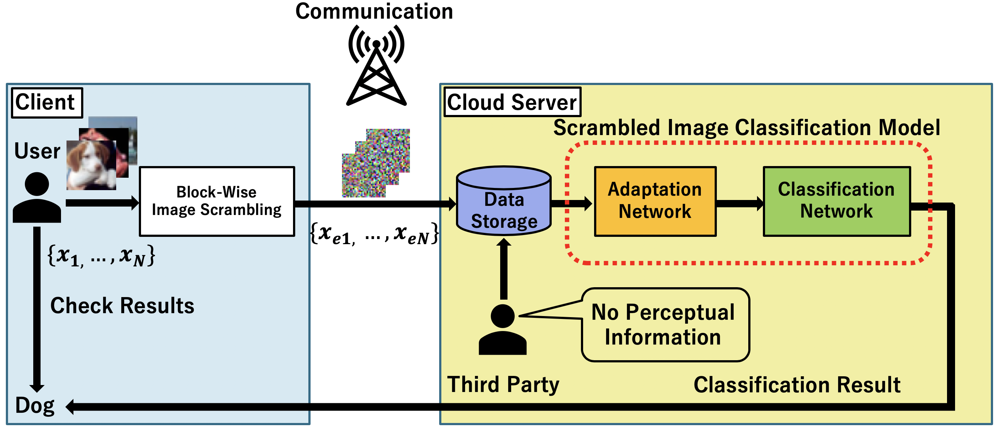

## Block-wise Scrambled Image Recognition Using Adaptation Network

This repository contains a Pytorch implementation of Proposed Adaptation Network in our AAAI WS 2020 paper:

Koki Madono, Masayuki Tanaka, Masaki Onishi, and Tetsuji Ogawa. Block-wise Scrambled Image Recognition Using Adaptation Network. In AAAI WS, 2020
<!-- [Arxiv] () -->

Adaptation Network is described in Section "Adaptation Network for Block-WiseScrambled Image Recognition"
<!-- <!-- Muhammed Kocabas, Salih Karagoz, Emre Akbas. MultiPoseNet: Fast Multi-Person Pose Estimation using Pose Residual Network. In ECCV, 2018. [Arxiv](https://arxiv.org/abs/1807.04067) - -->



This network can be used for cloud based machine learning in visual information hiding setting.


Scrambling method is described in this figure.
### Getting Started
We have tested our method on [cifar10/100 Dataset](https://www.cs.toronto.edu/~kriz/cifar.html)
(The dataset can be download via [pytorch code](https://pytorch.org/tutorials/beginner/blitz/cifar10_tutorial.html))

### Prerequisites
```
python
pytorch
numpy
scikit-image
```

### Installing

1. Clone this repository: 
`git clone https://github.com/MADONOKOUKI/aaai_ws.git`

2. Install [Pytorch](https://pytorch.org/).

3. ```pip install -r src/requirements.txt```

## Training

`python {args.1}_{args.2}_{args.3}`

args.1 : default(no adaptation network) / tanaka / proposed

args.2 : dataset(cifar10 / cifar100)

args.3 : encryption method(LE,ELE,EtC) or no encryption(plain)

We use [shakedrop](https://arxiv.org/abs/1802.02375) classifier as the backbone network with adaptation network.

## Results


## Citation
If you find this code useful for your research, please consider citing our paper:
```
@Inproceedings{madono2020,
  Title           = {Block-wise Scrambled Image Recognition Using Adaptation Network},
  Author         = {Koki Madono, Masayuki Tanaka, Masaki Onishi, and Tetsuji Ogawa},
  Booktitle      = {AAAI WS},
  Year           = {2020}
}
```

### Reference codes

- [mastnk/ICCE-TW2018](https://github.com/mastnk/ICCE-TW2018)
- [owruby/shake-drop_pytorch](https://github.com/owruby/shake-drop_pytorch)
- [utkuozbulak/pytorch-cnn-visualizations](https://github.com/utkuozbulak/pytorch-cnn-visualizations/blob/master/src/inverted_representation.py)

## License

MIT License. Please see the LICENSE file for details.